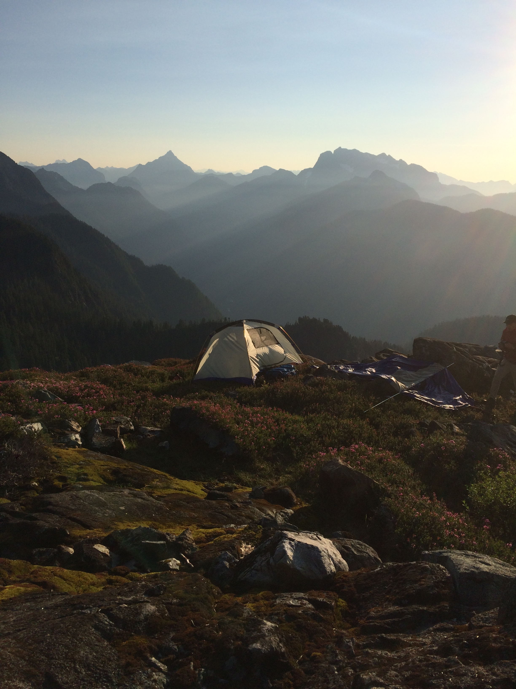

# Zeid's First Assignement for STAT545

## Introduction

**What is this for?**

* This is a repository to demonstrate my Markdown capabilities and some basic data exploration on R

**Who am I?**

* My name is Zeid Hamadeh. This is my first year apart of UBC's Genome Science and Technology Program. 

**Where I'm from?**

* I just moved to Vancouver in June from London, Ontario where I completed my bachelors degree at Western University.

## Places I've Lived Before

|    **City**    | **Time** |
|----------------|------------|
| Ottawa         | 1996-2010  |
| Toronto        | 2010-2014  |
| London         | 2014-2018  |
| Vancouver      | 2018-Pres  |

## About Me

### Famous Quotes

As some ancient philosopher somewhere said:

> Don't let your dreams be dreams

Michael Scott

> You miss 100% of the shots you don't take
> - Wayne Gretsky

## Assignments Page

You can find the detailed instructions for this assignment by going to the [assignments](http://stat545.com/Classroom/assignments/) page 

## Golden Ears National Park

Here is a picture of the mountain I hiked this summer

